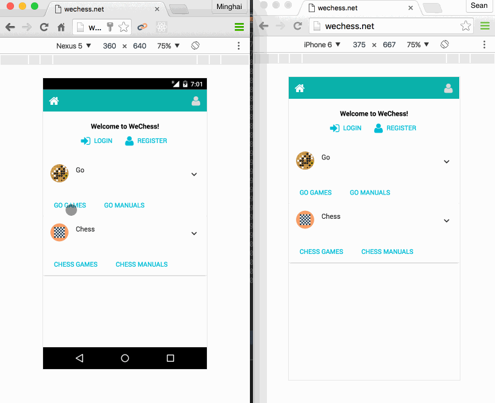
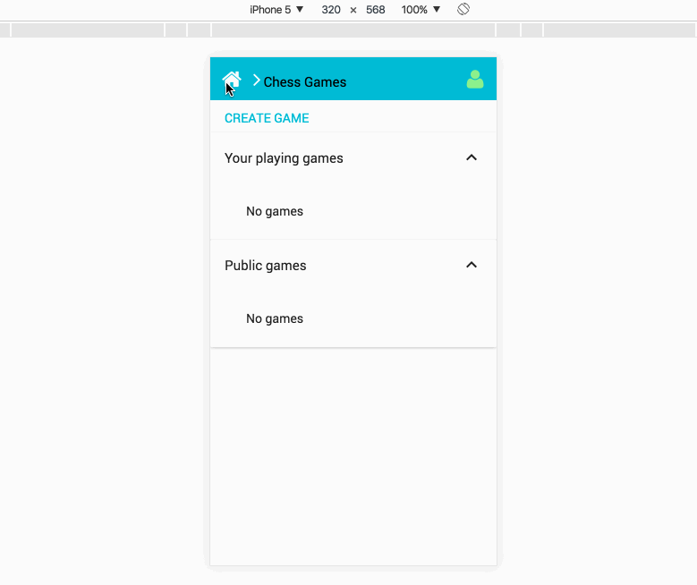

# WeChess - Online chess game application.



Animation to show how WeChess automatically adjust to different device:



## Demo app

[WeChess.net](http://wechess.net)


## Setting Up

* make sure you have Meteor installed
* clone this repo

```
npm install
npm start
```
Your app should be running [http://localhost:3000](http://localhost:3000)


## deploy


### deploy to AWS 

First make a copy setting-development.json to setting.json and fill out secret keys.

```
npm install -g mupx

mupx setup
mupx deploy

```


### deploy to modulus

```
npm deploy

```


MIT Licensce 